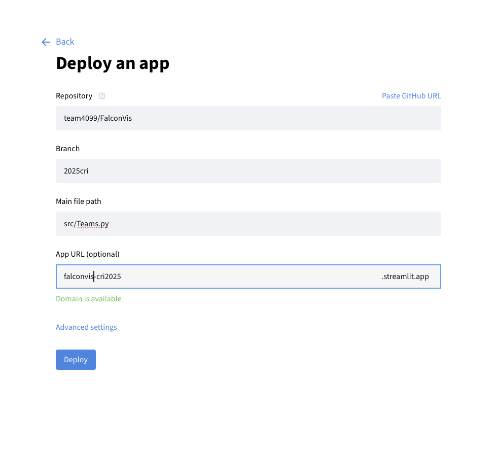
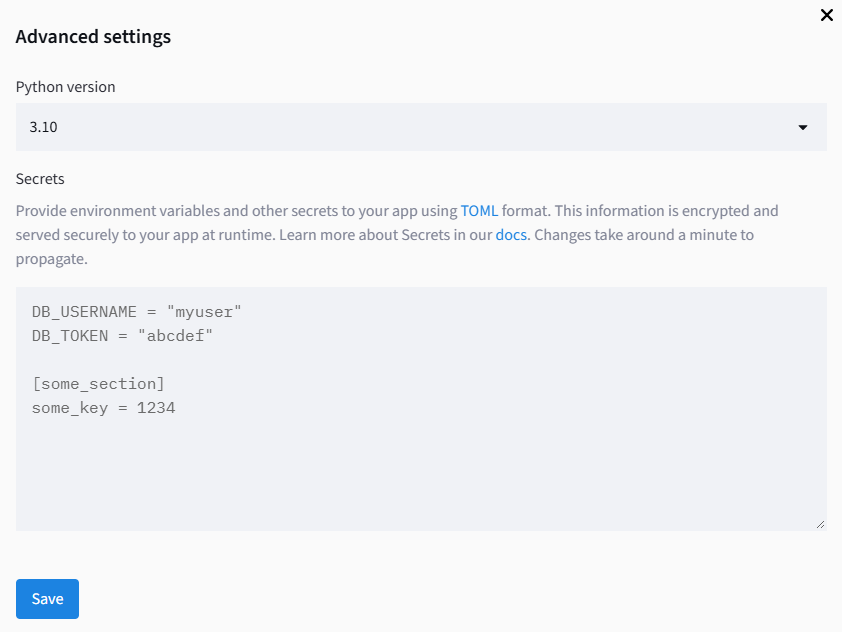

# FalconVis Deployment

We use Streamlit to deploy FalconVis for competitions.

###  Create Competition Branch

1. Create a new branch for the competiton
   ```bash
   git checkout -b <event code>
   ```
2. Edit [constants.py](../src/utils/constants.py) `EventSpecificConstants`:
   - Set the new `EVENT_CODE` and `EVENT_NAME`
3. Commit and push.

---

###  Deploy on Streamlit.io

1. Visit: [https://streamlit.io](https://streamlit.io)
2. Deploy app
   - Use the branch you just created
   - Use `Teams.py` as your file path
   - Use the naming scheme falconvis-[event code][event year]



3. In Advanced Settings, change the python version to 3.10


---

### Local Deployment

There have often been issues during events where FalconVis cannot load, especially in areas like pits. For that reason,
it has been made possible to pull data from a JSON instead of from GitHub. Place the data at the file path defined in 
[constants.py](../src/utils/constants.py) (`EventSpecificConstants.LOCAL_JSON_PATH`), and run with
```bash
python -m streamlit run app.py
```
> **NEVER EVER EVER** push the backup match data to Git. Verify that the path is in the `.gitignore`.
